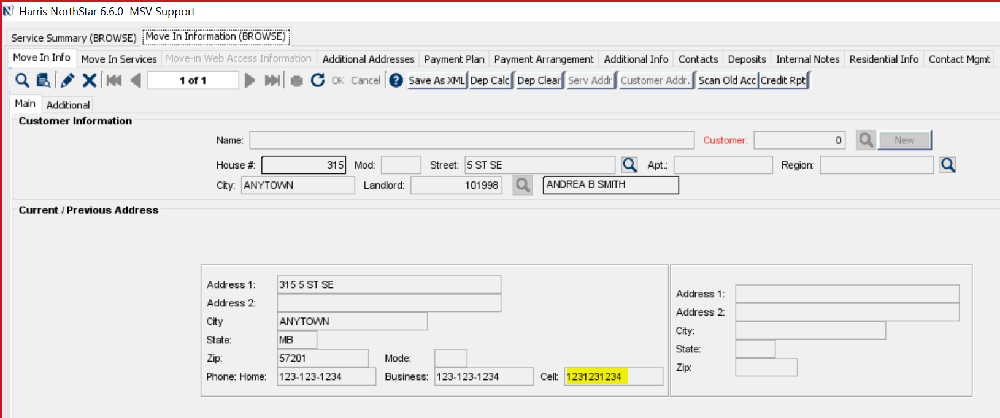

# Cell Phone Number Formatting is inconsistently applied

## Description

Some phone fields on move service orders ignore the phone number format specified by VALPHONEFORMAT.
See Cell Phone field on Move In orders.

## Acceptance Criteria

The Cell Phone field on Move-In orders uses the format specified by VALPHONEFORMAT.

## Current classes with reference to VALPHONEFORMAT

care/
    CallMaintenanceModel.java
    MoveInInfoModel.java
    MoveInModel.java
